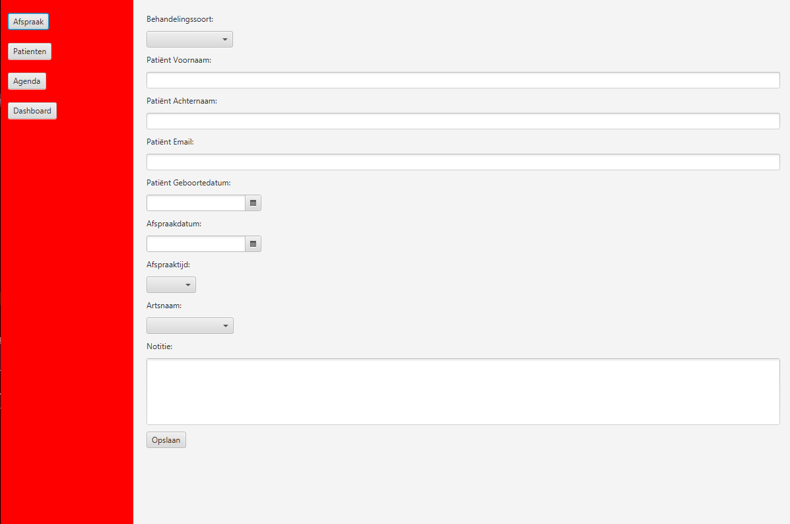

<a name="readme-top"></a>
<!-- PROJECT LOGO -->
<br />
<div align="center">
  <a href="https://github.com/AlexChulo/MedicalAppointmentSystem">
    
  </a>

  <h3 align="center">Medical Appointment System</h3>

  <p align="center">
    Welkom bij mijn Medical Appointment System project!
    <br />
    <a href="https://github.com/AlexChulo/MedicalAppointmentSystem"><strong>Bekijk de documentatie »</strong></a>
    <br />
    <br />
  </p>
</div>


<!-- TABLE OF CONTENTS -->
<details>
  <summary>Table of Contents</summary>
  <ol>
    <li>
      <a href="#about-the-project">About The Project</a>
      <ul>
        <li><a href="#built-with">Built With</a></li>
      </ul>
    </li>
    <li>
      <a href="#getting-started">Getting Started</a>
      <ul>
        <li><a href="#prerequisites">Prerequisites</a></li>
        <li><a href="#installation">Installation</a></li>
      </ul>
    </li>
    <li><a href="#usage">Usage</a></li>
    <li><a href="#roadmap">Roadmap</a></li>
    <li><a href="#contributing">Contributing</a></li>
    <li><a href="#license">License</a></li>
    <li><a href="#contact">Contact</a></li>
    <li><a href="#acknowledgments">Acknowledgments</a></li>
    <li><a href="#communicatiestrategie">Communicatiestrategie en Evaluatie</a></li>
    <li><a href="#implementatie">Huidige Staat en Productieomgeving Implementatie</a></li>
  </ol>
</details>


<!-- ABOUT THE PROJECT -->
## About The Project



Mijn Medical Appointment System biedt de volgende functionaliteiten:

- Registreren en inloggen voor gebruikers
- Afspraken maken en beheren
- CRUD-functionaliteit (Create, Read, Update, Delete) voor patiënten en afspraken

Met dit systeem kunnen gebruikers eenvoudig hun medische afspraken beheren en up-to-date blijven met hun gezondheidsinformatie.

# Here's why:

1. **Efficiëntie**: Een digitaal afspraaksysteem kan de efficiëntie van een medische praktijk aanzienlijk verbeteren door het proces van het plannen en beheren van afspraken te stroomlijnen. Het vermindert de kans op dubbele boekingen, verkeerd ingeplande afspraken en handmatige fouten, waardoor de tijd van het personeel beter wordt benut.

2. **Toegankelijkheid**: Met een online afspraaksysteem kunnen medewerkers afspraken efficiënt plannen en beheren, waardoor ze meer tijd hebben voor directe patiëntenzorg. Dit verbetert de toegankelijkheid van de zorg en verhoogt de efficiëntie van de medische praktijk.

3. **Patiëntgerichtheid**: Hoewel patiënten geen afspraken maken, draagt een goed georganiseerd afspraaksysteem bij aan een positieve ervaring voor patiënten. Het stelt het personeel in staat om snel en nauwkeurig afspraken in te plannen, waardoor de wachttijden worden verkort en de patiënttevredenheid toeneemt.


<p align="right">(<a href="#readme-top">back to top</a>)</p>


### Built With

[//]: # (Icons)
[Java]: https://img.shields.io/badge/Java-007396?style=for-the-badge&logo=java&logoColor=white
[MySQL]: https://img.shields.io/badge/MySQL-4479A1?style=for-the-badge&logo=mysql&logoColor=white
[IntelliJ IDEA]: https://img.shields.io/badge/IntelliJ%20IDEA-000000?style=for-the-badge&logo=intellij-idea&logoColor=white

[//]: # (URLs)
[Java-url]: https://www.java.com/
[MySQL-url]: https://www.mysql.com/
[IntelliJ-url]: https://www.jetbrains.com/idea/

[//]: # (Badges)
* [![Java][Java]][Java-url]
* [![MySQL][MySQL]][MySQL-url]
* [![IntelliJ IDEA][IntelliJ IDEA]][IntelliJ-url]

<p align="right">(<a href="#readme-top">back to top</a>)</p>

## Installation Instructions

Volg deze stappen om het project te installeren:

1. **Vereisten**
    - Zorg ervoor dat je de volgende software geïnstalleerd hebt:
        - [Java JDK](https://www.oracle.com/java/technologies/javase-jdk11-downloads.html) (versie 11 of hoger)
        - [IntelliJ IDEA](https://www.jetbrains.com/idea/)
        - [MySQL](https://dev.mysql.com/downloads/installer/)
        - [XAMPP](https://www.apachefriends.org/index.html) (optioneel, voor een eenvoudige installatie van MySQL en PHPMyAdmin)

2. **Clone de repository**
    ```sh
    git clone https://github.com/AlexChulo/MedicalAppointmentSystem.git
    cd MedicalAppointmentSystem
    ```

3. **Installeer de MySQL-database**
    - Als je XAMPP gebruikt, start MySQL via het XAMPP Control Panel.
    - Open MySQL Workbench of een andere MySQL-client.
    - Importeer de meegeleverde database dump `medical_appointment_system.sql` die je in de repository kunt vinden.
    - Gebruik de volgende commando's om de database te importeren:
      ```sql
      SOURCE /path/to/your/repo/MedicalAppointmentSystem/database/medical_appointment_system.sql;
      ```

4. **Configureer de databaseverbinding**
    - Open het project in IntelliJ IDEA.
    - Ga naar het bestand `src/main/resources/database.properties` en zorg ervoor dat de database-instellingen correct zijn:
      ```properties
      db.url=jdbc:mysql://localhost:3306/medisch
      db.user=root
      db.password=yourpassword
      ```

5. **Build en run de applicatie**
    - Gebruik IntelliJ IDEA om het project te bouwen en uit te voeren. Klik op 'Run' om de applicatie te starten.

<p align="right">(<a href="#readme-top">back to top</a>)</p>

## Gebruiksgids

**Volg deze stappen om het systeem te gebruiken:**

### Registreren en inloggen

1. Start de applicatie.
2. Klik op 'Registreren' om een nieuw account aan te maken.
3. Vul de vereiste gegevens in en klik op 'Registreren'.
4. Log in met je nieuwe account.

### Afspraken maken en beheren

1. Na het inloggen, kom je meteen bij het 'Afspraken' gedeelte terecht.
2. Vul de details in het formulier in en klik op 'Opslaan' om een nieuwe afspraak te maken.
3. Beheer bestaande afspraken bij het gedeelte 'Agenda' en selecteer de afspraak om te kunnen 'Updaten' of 'Verwijderen.

### Patiënten toevoegen en beheren

1. Maak een 'Afspraak' of navigeer naar het 'Patiënten' gedeelte.
2. Voeg nieuwe patiënten toe door op 'Add' te klikken en de details in te vullen.
3. Beheer bestaande patiënten door op 'Update' of 'Delete' te klikken op de geselecteerde patiënt.


<!-- ROADMAP -->
## Roadmap

Hier is een tijdlijn voor de geplande functies en verbeteringen:

- [x] Registratie functie (Q2 2024)
- [x] Login Functie (Q2 2024)
- [x] Afspraken creatie (Q2 2024)
- [x] CRUD op gemaakte afspraken (Q2 2024)
- [X] CRUD voor Patiënten (Q2 2024)
- [ ] Behandeling dossier (Q2 2024)
- [ ] CRUD voor Behandeling dossier (Q3 2024)
- [ ] Zoekbalk voor Afspraken (Q3 2024)
- [ ] Zoekbalk voor Patiënten (Q3 2024)
<p align="right">(<a href="#readme-top">back to top</a>)</p>


## Communicatiestrategie en Evaluatie

Voor de implementatie van dit systeem is een communicatiestrategie opgesteld om ervoor te zorgen dat alle stakeholders op de hoogte zijn van de voortgang en eventuele problemen:

1. **Wekelijkse Updates**: Wekelijkse vergaderingen met het team om de voortgang te bespreken en eventuele problemen op te lossen.
2. **Stakeholder Communicatie**: Maandelijkse updates naar stakeholders om hen op de hoogte te houden van de projectstatus.
3. **Feedback Cyclus**: Regelmatige feedbacksessies met gebruikers om hun ervaringen en suggesties te verzamelen.

De uiteindelijke situatie wordt geëvalueerd en geverifieerd door:
- **Gebruikersonderzoeken**: Uitvoeren van enquêtes onder gebruikers om de effectiviteit en gebruiksvriendelijkheid van het systeem te beoordelen.
- **Systeemmonitoring**: Continue monitoring van het systeem om prestaties en betrouwbaarheid te waarborgen.
- **Testen**: Uitvoeren van uitgebreide tests om ervoor te zorgen dat alle functionaliteiten correct werken voordat nieuwe updates worden uitgerold.

<p align="right">(<a href="#readme-top">back to top</a>)</p>

## Huidige Staat en Productieomgeving Implementatie

Het huidige systeem is volledig operationeel voor het beheren van medische afspraken en patiënteninformatie. Om dit systeem in een productieomgeving te implementeren, volg de onderstaande stappen:

1. Zorg ervoor dat alle vereisten (JavaFX, MySQL, IntelliJ IDEA) zijn geïnstalleerd.
2. Clone de repository en configureer de database zoals beschreven in de installatie-instructies.
3. Deploy de applicatie op een productie server, zorg ervoor dat de server toegang heeft tot de MySQL-database.
4. Configureer de server om de applicatie automatisch te starten en draai periodieke back-ups van de database.


<!-- CONTACT -->
## Contact

Alex Chu - (al.chu@ad-academie.nl)

Project Link: [https://github.com/AlexChulo/MedicalAppointmentSystem](https://github.com/AlexChulo/MedicalAppointmentSystem)

<p align="right">(<a href="#readme-top">back to top</a>)</p>

